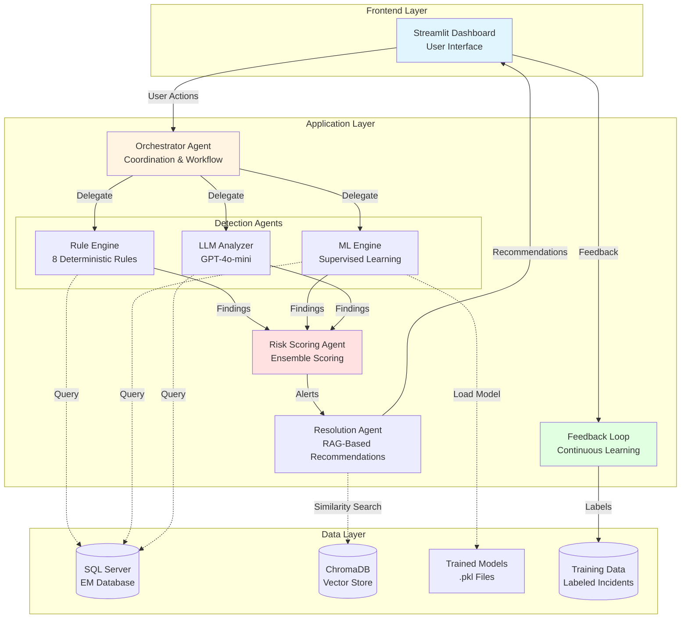
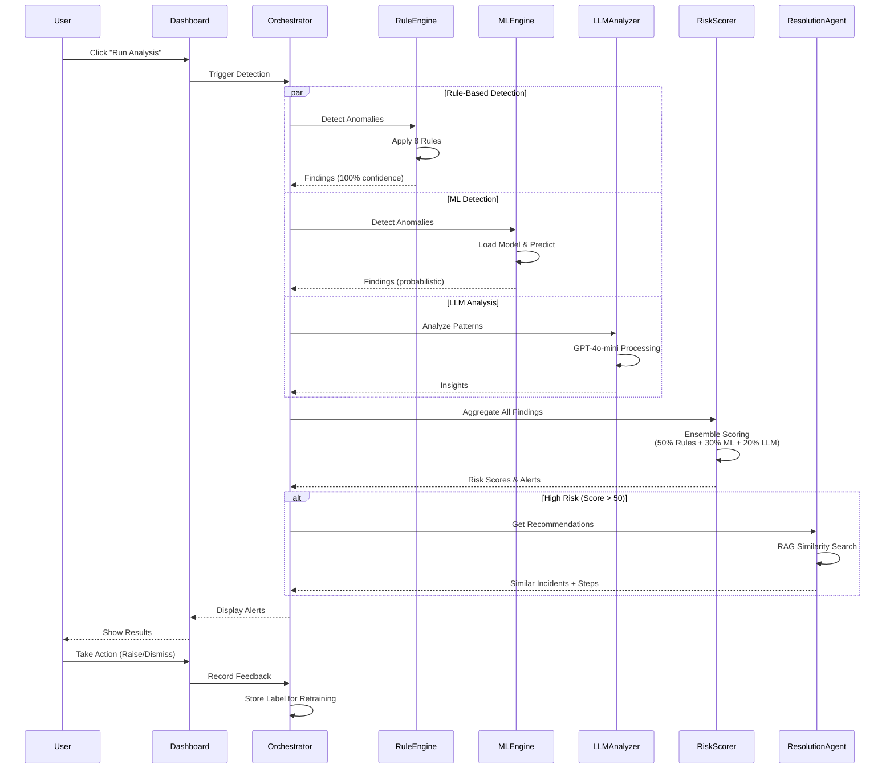
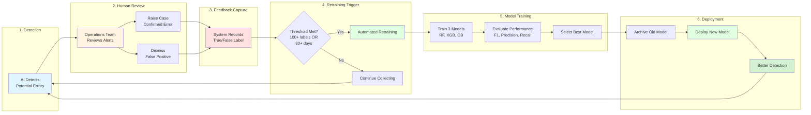
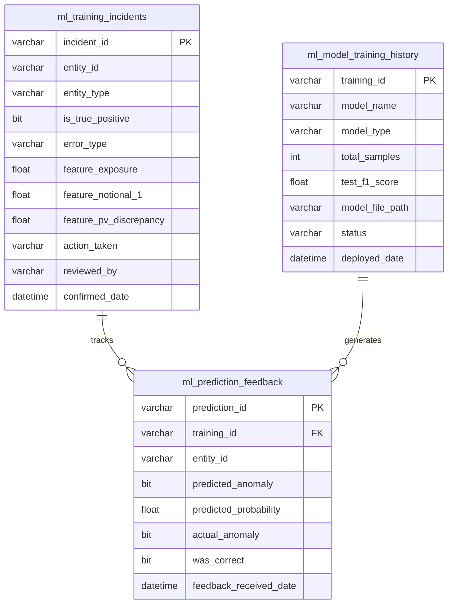
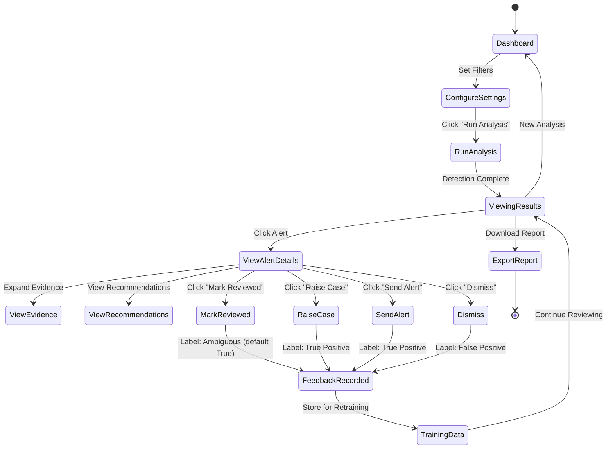
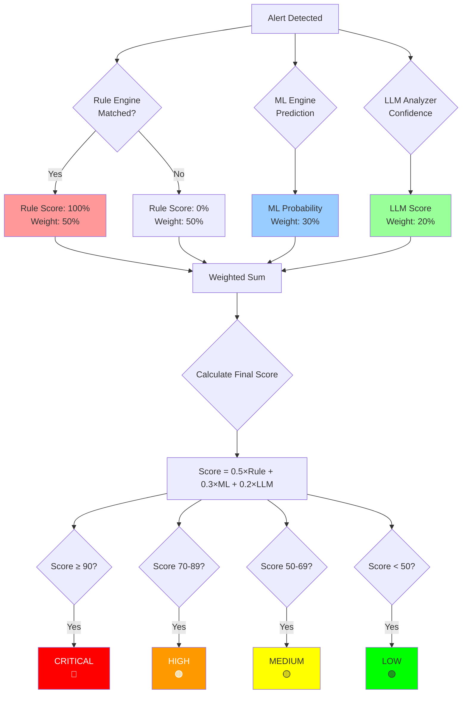
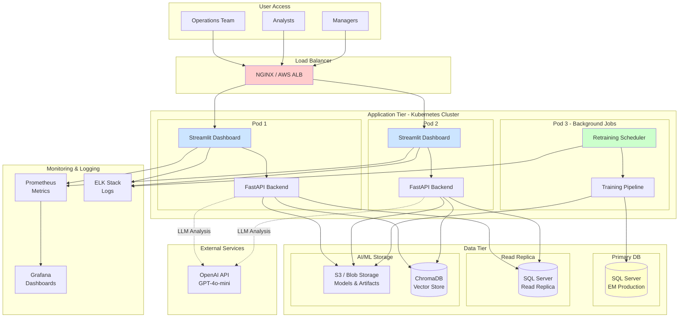
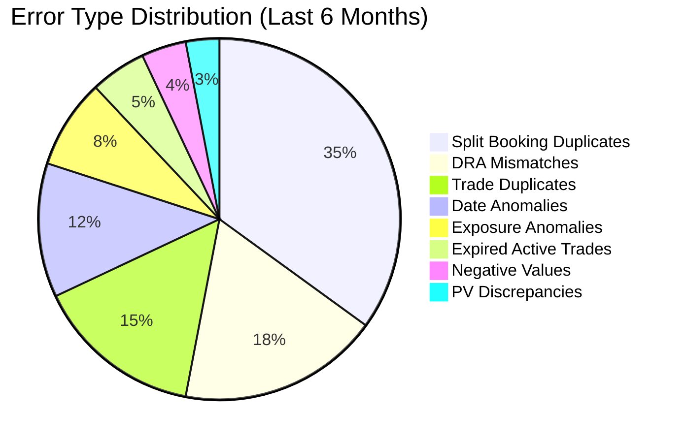
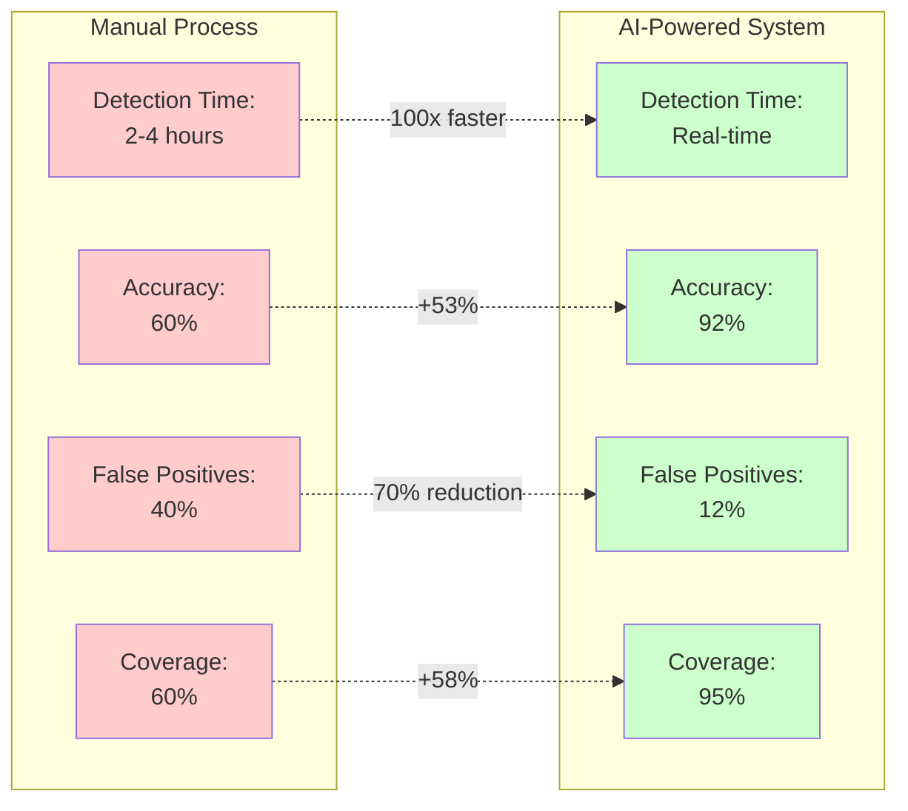
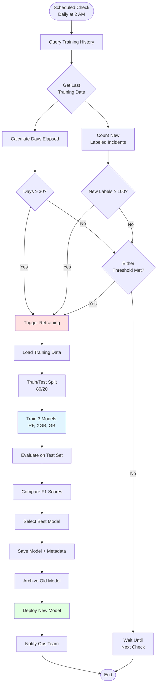

# Architecture Diagrams for Presentation

These Mermaid diagrams can be rendered using:
- GitHub/GitLab (native support)
- https://mermaid.live (online editor - copy/paste and export as PNG/SVG)
- VS Code with Mermaid extension
- PowerPoint with Mermaid plugin

---

## Diagram 1: System Architecture Overview



---

## Diagram 2: Multi-Agent Detection Flow



---

## Diagram 3: Continuous Learning Cycle



---

## Diagram 4: Database Schema - Training Data



---

## Diagram 5: Dashboard User Flow



---

## Diagram 6: Ensemble Scoring Algorithm



---

## Diagram 7: Deployment Architecture



---

## Diagram 8: Error Detection Rules Coverage



---

## Diagram 9: Performance Comparison



---

## Diagram 10: Retraining Decision Logic



---

## How to Export These Diagrams for PowerPoint

### Method 1: Mermaid Live Editor (Easiest)
1. Go to https://mermaid.live
2. Copy any diagram code above
3. Paste into the editor
4. Click "Actions" → "PNG" or "SVG"
5. Download and insert into PowerPoint

### Method 2: VS Code (For Batch Export)
1. Install "Markdown Preview Mermaid Support" extension
2. Open this file in VS Code
3. Right-click each diagram → "Export to PNG"
4. Insert all PNGs into PowerPoint

### Method 3: GitHub (If Repository is Private)
1. Push this file to GitHub
2. View the rendered diagrams
3. Take screenshots or use browser extensions to export

### Method 4: Command Line (Mermaid CLI)
```bash
npm install -g @mermaid-js/mermaid-cli
mmdc -i ARCHITECTURE_DIAGRAMS.md -o diagrams/ -e png
```

---

## Diagram Color Legend

- **Blue** (#e1f5ff): Frontend/User-facing
- **Yellow** (#fff4e1): Application Logic
- **Red** (#ffe1e1): Critical Paths
- **Green** (#e1ffe1): Success States/Positive Actions
- **Gray** (#f5f5f5): Data Storage
