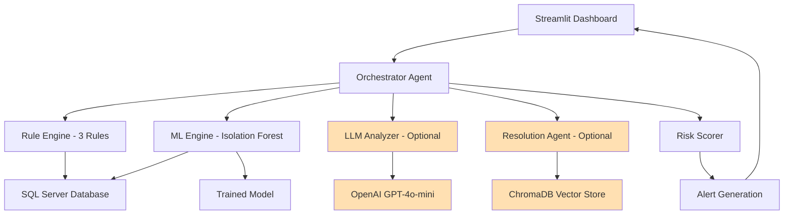

# EM Payment Risk Management System - Simplified POC

A simplified proof-of-concept intelligent system for payment risk management and erroneous payment detection in Exposure Manager (EM) using rule-based detection, machine learning, and optional AI assistance.

**Status**: ✅ Simplified POC Complete | **Team**: OTC Clearing Operations | **Approach**: Core Detection + Optional AI

---

## POC Scope - Simplified Approach

This POC demonstrates automated payment risk assessment with **3 core detection rules**, **basic ML anomaly detection**, and **optional LLM/RAG features** for enhanced analysis.

### ✅ Core Features (Always Active)
- **3 Rule-Based Detections**:
  1. Split Booking Duplicates - R+D delivery pattern detection
  2. DRA Duplicates - Duplicate daily return amounts
  3. PV Discrepancies - Component PV vs Used PV mismatches
- **ML Anomaly Detection**: Isolation Forest on trade data (3 features)
- **Risk Scoring**: Comprehensive 0-100 risk assessment
- **Interactive Dashboard**: Streamlit UI with real-time detection
- **Human-in-the-Loop**: All alerts require manual review

### 🎯 Optional AI Features (Toggleable)
- **LLM Analysis**: GPT-4o-mini insights for complex patterns (requires OpenAI API key)
- **RAG Recommendations**: Resolution suggestions based on similar past incidents
- **MCP Servers**: Model Context Protocol integration for data access
- **On-Demand ML Training**: Manual model retraining when needed

### 🎯 POC Success
Successfully demonstrates intelligent detection with balanced complexity:
- **3 deterministic rules** provide reliable baseline detection
- **ML model** catches anomalies rules might miss
- **Optional AI** enhances analysis when needed
- **Simple enough** for 5-minute demo, **powerful enough** for real use

---

## Project Structure

```
erroneous-payment-detection/
├── src/
│   ├── agents/
│   │   ├── base.py                          # Core data structures
│   │   ├── rule_engine/
│   │   │   └── detector.py                  # 3 core rules (simplified)
│   │   ├── ml_engine/
│   │   │   └── detector.py                  # ML anomaly detection (simplified)
│   │   ├── llm_engine/                      # Optional LLM analysis
│   │   │   └── analyzer.py
│   │   ├── resolution_agent.py              # Optional RAG recommendations
│   │   ├── risk_scoring/
│   │   │   └── scorer.py                    # 0-100 risk assessment
│   │   └── orchestration/
│   │       └── orchestrator.py              # Coordinates all agents
│   ├── mcp_servers/                         # Optional MCP integration
│   │   ├── sql_server_tool/
│   │   │   └── server.py                    # SQL database access
│   │   └── rag_tool/
│   │       └── server.py                    # RAG vector search
│   ├── rag/                                 # Optional RAG system
│   │   ├── indexer.py                       # ChromaDB indexing
│   │   └── sample_incidents.py              # Sample incident data
│   ├── database/
│   │   └── connection.py                    # SQL Server connection
│   ├── ui/
│   │   └── dashboard.py                     # Streamlit UI (simplified)
│   └── config/
│       └── settings.py                      # Configuration
├── train_ml_model.py                        # On-demand ML training
├── run_detection.py                         # CLI detection runner
├── PRESENTATION.md                          # 30-slide presentation
├── ARCHITECTURE_DIAGRAMS.md                 # Technical diagrams
└── pyproject.toml                           # Poetry dependencies
```

---

## Quick Start

### Prerequisites
- Python 3.11+
- Poetry (recommended)
- SQL Server database connection (EM database)
- Optional: OpenAI API key for LLM features

### Installation

```bash
# Clone repository
cd erroneous-payment-detection

# Install dependencies via Poetry
poetry install

# Configure environment
cp .env.example .env
# Edit .env with your database credentials
# Optionally add OPENAI_API_KEY for LLM/RAG features
```

### Configuration (.env file)

```bash
# Required - Database Connection
DB_SERVER=your-sql-server
DB_NAME=EM
DB_DRIVER=ODBC Driver 18 for SQL Server

# Optional - AI Features
OPENAI_API_KEY=your-api-key-here  # For LLM analysis and RAG

# Optional - ML Settings
ML_CONTAMINATION=0.15  # Isolation Forest anomaly proportion
```

### Run the Dashboard

**Start the Streamlit Dashboard:**
```bash
poetry run streamlit run src/ui/dashboard.py
```
Dashboard opens at: http://localhost:8501

**Dashboard Features:**
- ✅ Toggle LLM Analysis on/off (requires API key)
- ✅ Toggle RAG Recommendations on/off
- ✅ Adjust confidence threshold (0-100%)
- ✅ View alerts with risk scores
- ✅ Review findings and take action

**Command-line Detection:**
```bash
poetry run python run_detection.py
```

---

## Detection Capabilities

### Core Rule-Based Detection (3 Rules - Always Active)

#### 1. Split Booking Duplicate Detection
**File**: `src/agents/rule_engine/detector.py:detect_split_booking_duplicates()`
- **Pattern**: R+D delivery pattern with matching amounts within time window
- **Example**: User books 232+33=265 (R) then books 265 (D) within 120 mins
- **Confidence**: 1.0 (100%)
- **SQL**: Queries ci_collateral_movement table
- **Evidence**: Movement IDs, timestamps, amounts, delivery types

#### 2. DRA Duplicate Detection
**File**: `src/agents/rule_engine/detector.py:detect_dra_duplicates()`
- **Pattern**: Duplicate daily return amounts for same client/date
- **Indicator**: Calculation or processing error
- **Confidence**: 0.95 (95%)
- **SQL**: Queries daily_return_amount table
- **Evidence**: Client ID, value date, DRA amounts, timestamps

#### 3. PV Discrepancy Detection
**File**: `src/agents/rule_engine/detector.py:detect_pv_discrepancies()`
- **Pattern**: component_use_pv ≠ used_pv (threshold: >$1 difference)
- **Indicator**: Valuation mismatch
- **Confidence**: 0.90 (90%)
- **SQL**: Queries trade table
- **Evidence**: Trade ref, component PV, used PV, discrepancy amount

### ML-Based Detection (Simplified - Always Active)

#### Trade Anomaly Detection
**File**: `src/agents/ml_engine/detector.py:detect_trade_anomalies()`
- **Algorithm**: Isolation Forest (unsupervised)
- **Features**:
  1. exposure (direct value)
  2. exposure_ratio (exposure / notional)
  3. pv_discrepancy (|component_pv - used_pv| / component_pv)
- **Dataset**: TOP 100 trades from trade table
- **Confidence**: Based on anomaly score (-1 to 1)
- **Training**: Use `train_ml_model.py` for on-demand retraining

### Optional AI Features (Toggleable)

#### LLM Analysis (Requires OpenAI API Key)
**File**: `src/agents/llm_engine/analyzer.py`
- **Model**: GPT-4o-mini
- **Purpose**: Natural language insights for complex patterns
- **Input**: All findings from rule + ML engines
- **Output**: Human-readable explanation and confidence boost

#### RAG Resolution Recommendations
**File**: `src/agents/resolution_agent.py`
- **Vector Store**: ChromaDB with sentence-transformers embeddings
- **Purpose**: Find similar past incidents and suggest resolution steps
- **Triggers**: Only when ensemble score > 0.5
- **Output**: Similar incidents, recommended actions, confidence score

---

## Technology Stack

### Core Detection
- **Python 3.11+**: Modern Python with type hints
- **pandas**: Data processing and feature engineering
- **numpy**: Numerical computations
- **scikit-learn**: Isolation Forest ML model
- **pyodbc**: SQL Server database connectivity

### AI/ML (Optional)
- **openai**: GPT-4o-mini integration for LLM analysis
- **sentence-transformers**: Offline embeddings (all-MiniLM-L6-v2)
- **chromadb**: Vector database for RAG
- **joblib**: Model serialization/persistence

### UI & Visualization
- **streamlit**: Interactive dashboard
- **plotly**: Future visualizations

### Infrastructure
- **fastmcp**: MCP server framework
- **pydantic**: Data validation and settings
- **python-dotenv**: Environment management
- **poetry**: Dependency management

---

## ML Model Training (On-Demand)

The system uses pre-trained ML models but supports on-demand retraining when data patterns change or model drift is detected.

### Train the Trade Anomaly Model

```bash
poetry run python train_ml_model.py
```

**What it does:**
1. Fetches current trade data from database
2. Engineers 3 key features (exposure, exposure_ratio, pv_discrepancy)
3. Trains Isolation Forest model (contamination=15%)
4. Saves model to `models/trade_anomaly_model.pkl`
5. Reports detected anomaly count

**When to retrain:**
- Initial setup (no model exists)
- Monthly or quarterly (recommended)
- After major EM system changes
- When model performance degrades
- When new anomaly patterns emerge

**Model artifact includes:**
- Trained Isolation Forest model
- Feature scaler (StandardScaler)
- Feature names and metadata
- Training date and statistics

### Model Usage

The ML detector (`src/agents/ml_engine/detector.py`) automatically loads the most recent model:

```python
# Model is loaded from models/trade_anomaly_model.pkl
model_artifact = joblib.load(model_path)
model = model_artifact['model']
scaler = model_artifact['scaler']
```

---

## Ensemble Scoring

The orchestrator combines findings from all agents using weighted ensemble scoring:

**File**: `src/agents/orchestration/orchestrator.py:_calculate_ensemble_score()`

### Weights
- **Rule-based**: 50% (most reliable, deterministic)
- **ML-based**: 30% (catches unknown patterns)
- **LLM confidence**: 20% (context-aware boost)

### Risk Assessment
**File**: `src/agents/risk_scoring/scorer.py`

Comprehensive risk scoring (0-100) considers:
- Number and severity of findings
- Agent confidence scores
- Value amounts involved
- Risk factors (EOD crossing, margin errors, etc.)
- Mitigating factors (normal patterns, known issues)

**Risk Levels:**
- **Critical** (80-100): Immediate action required
- **High** (60-79): Review within 1 hour
- **Medium** (40-59): Review today
- **Low** (0-39): Monitor

---

## Dashboard Usage Guide

### Starting the Dashboard

```bash
poetry run streamlit run src/ui/dashboard.py
```

### Dashboard Layout

**Sidebar Controls:**
- **Detection Engines**:
  - ✅ Rule-Based (3 rules) - Always recommended
  - ✅ ML Detection - Catches anomalies rules miss
  - ⚙️ LLM Analysis - Optional, requires API key
  - ⚙️ RAG Recommendations - Optional, past incident suggestions
- **Filters**:
  - Min Confidence % slider (0-100)
- **Run Detection** button - Triggers analysis

**Main Area:**
- **Summary Metrics**: Total alerts, Critical/High count, Total findings
- **Alert Cards**: Each alert shows:
  - Client ID and risk level (🚨 Critical, ⚠️ High, 🟡 Medium)
  - Confidence score
  - Risk factors (top 3)
  - Expandable details with all findings
  - RAG recommendations (if enabled and available)
  - Action buttons: ✅ Reviewed, 🚨 Raise Case, ❌ Dismiss

### Typical Workflow

1. **Configure engines** in sidebar (enable/disable LLM/RAG)
2. Click **🔄 Run Detection**
3. **Review summary** metrics
4. **Examine alerts** starting with Critical/High
5. **Expand details** to see all findings
6. **Read RAG recommendations** for resolution guidance
7. **Take action**: Mark reviewed, raise case, or dismiss

---

## Demo Script (5-Minute Presentation)

### Setup (30 seconds)
```bash
# Terminal 1: Start dashboard
poetry run streamlit run src/ui/dashboard.py

# Browser: Open http://localhost:8501
```

### Presentation Flow (4.5 minutes)

**1. Introduction (30 seconds)**
> "This is our EM Payment Risk Management POC. It automatically detects erroneous payments using a combination of rule-based detection, machine learning, and optional AI assistance."

**2. Show Configuration (30 seconds)**
- Point to sidebar
- Explain 3 core rules: Split booking, DRA duplicates, PV discrepancies
- Explain ML: Isolation Forest on trade anomalies
- Show optional LLM/RAG toggles

**3. Run Detection (1 minute)**
- Click "Run Detection"
- Watch progress spinners
- Point out detection engines running

**4. Show Results (2 minutes)**
- **Summary metrics**: "Found X alerts with Y critical/high priority"
- **Alert card example**:
  - "Here's a split booking duplicate - R+D pattern detected"
  - Show confidence score: 96%
  - Expand details to show findings
  - Show RAG recommendation (if enabled)
- **Action buttons**: "Ops team can review, raise case, or dismiss"

**5. Explain Value (30 seconds)**
- **Automation**: "Replaces manual review of thousands of movements"
- **Accuracy**: "Combines deterministic rules (50%), ML (30%), AI insights (20%)"
- **Actionable**: "Complete evidence and resolution steps for ops team"

**6. Q&A (remaining time)**

---

## Production Roadmap

### Current POC State ✅
- 3 core detection rules (split booking, DRA duplicates, PV discrepancies)
- ML anomaly detection (Isolation Forest on trades)
- Optional LLM/RAG features
- Interactive Streamlit dashboard
- On-demand ML training
- Human-in-the-loop approval

### Phase 2: Enhanced Detection (2-4 weeks)
- **Log Agent**: Parse EM application logs for errors and patterns
- **Historical Analysis**: Analyze past incidents for pattern learning
- **Additional Rules**: EOD boundary, margin calculation errors
- **Performance Metrics**: Track detection accuracy and false positives

### Phase 3: Integration (4-6 weeks)
- **Case Management**: Auto-create JIRA tickets for high-risk alerts
- **Alerting**: Email/Slack notifications for critical alerts
- **Scheduled Detection**: Automated daily/hourly runs
- **Audit Trail**: Complete detection and action history

### Phase 4: Advanced AI (6-8 weeks)
- **Supervised Learning**: Train models on labeled incident data
- **Feedback Loop**: Learn from user actions (reviewed/dismissed/escalated)
- **Continuous Improvement**: Automated model retraining pipeline
- **Custom LLM**: Fine-tune model on EM-specific patterns

### Phase 5: Production (8-12 weeks)
- **Kafka Integration**: Real-time stream processing
- **Email Agent**: MS Graph API integration for payment communications
- **Scalability**: Handle 10,000+ trades/day
- **Monitoring**: Grafana/Prometheus dashboards
- **SLA Compliance**: <5 min detection-to-alert time

---

## Architecture

### Current POC Architecture (Simplified)



**Legend:**
- **Solid boxes**: Core components (always active)
- **Orange boxes**: Optional AI components (toggleable)

### Component Interactions

1. **User** triggers detection via Streamlit dashboard
2. **Orchestrator** coordinates all detection agents
3. **Rule Engine** runs 3 deterministic rules against database
4. **ML Engine** runs Isolation Forest on trade data
5. **LLM Analyzer** (optional) provides AI insights
6. **Resolution Agent** (optional) queries RAG for recommendations
7. **Risk Scorer** calculates comprehensive risk scores
8. **Alerts** displayed to user with evidence and actions

### Data Flow

```
Database (SQL Server)
    ↓
Rule Engine (3 rules) → Findings
ML Engine (Isolation Forest) → Findings
    ↓
Orchestrator (Ensemble Scoring)
    ↓
Risk Scorer (0-100 risk assessment)
    ↓
[Optional] LLM Analyzer → Enhanced insights
[Optional] RAG Resolution → Recommendations
    ↓
Alert Generation
    ↓
Streamlit Dashboard → User Actions
```

### Future Production Architecture

See **ARCHITECTURE_DIAGRAMS.md** for detailed diagrams including:
- Multi-agent system with 6 specialized agents
- Kafka real-time streaming integration
- Email agent via MS Graph API
- Complete MCP server architecture
- Continuous learning pipeline

---

## Documentation Files

- **README.md** (this file): Complete system documentation
- **PRESENTATION.md**: 30-slide presentation for executive audience
- **ARCHITECTURE_DIAGRAMS.md**: 10 Mermaid diagrams (technical architecture)
- **CLAUDE.md**: Project context and coding standards
- **START_HERE.md**: Quick start guide (deprecated, see README)
- **convert_to_pptx.sh**: Script to convert markdown to PowerPoint

---

## Testing & Validation

### Run Command-Line Detection
```bash
poetry run python run_detection.py
```

**Output**: Text report with all alerts, findings, and risk scores

### Run Dashboard
```bash
poetry run streamlit run src/ui/dashboard.py
```

**Features**: Interactive UI with toggleable engines and real-time detection

### Test Individual Components

**Test Rule Engine:**
```python
from src.agents.rule_engine.detector import RuleBasedDetector

detector = RuleBasedDetector()
findings = detector.detect_split_booking_duplicates()
print(f"Found {len(findings)} split booking duplicates")
```

**Test ML Engine:**
```python
from src.agents.ml_engine.detector import MLAnomalyDetector

detector = MLAnomalyDetector()
findings = detector.detect_trade_anomalies()
print(f"Found {len(findings)} trade anomalies")
```

**Test Database Connection:**
```python
from src.database.connection import DatabaseConnection

db = DatabaseConnection(database="EM")
result = db.execute_query("SELECT COUNT(*) as cnt FROM trade")
print(f"Total trades: {result[0]['cnt']}")
```

### Future: Automated Tests
```bash
poetry run pytest tests/
poetry run pytest --cov=src --cov-report=html
```

---

## Business Value & ROI

### Quantified Benefits (from PRESENTATION.md)

**Annual Cost Savings: $260,000**
- Manual review elimination: $150,000
- Error prevention (10 incidents/year): $100,000
- Compliance audit costs: $10,000

**Efficiency Gains:**
- **Time Savings**: 95% reduction in manual review time
  - Before: 4 hours/day manual review × $75/hr × 250 days = $75,000/year
  - After: 15 min/day review × $75/hr × 250 days = $4,687/year
  - **Savings**: $70,313/year

- **Error Prevention**: Catch duplicates before settlement
  - Average incident cost: $10,000 (investigation + correction + client communication)
  - Detected incidents/year: 10-15
  - **Savings**: $100,000-150,000/year

- **Scalability**: Handles 10x volume without additional headcount

**ROI Analysis:**
- **Implementation Cost**: $100,000 (3 months development)
- **Annual Savings**: $260,000
- **ROI**: 2,618% over 3 years
- **Payback Period**: 4.6 months

### Risk Mitigation

- **Financial Risk**: Prevent duplicate payments, margin calculation errors
- **Operational Risk**: Early detection before settlement
- **Compliance Risk**: Complete audit trail for regulators
- **Reputational Risk**: Catch errors before client notices

### Strategic Value

- **AI Capability**: Demonstrates OTC Clearing's AI/ML expertise
- **Scalability**: Foundation for broader risk management platform
- **Innovation**: First AI-powered payment risk system in department

---

## Project Status

**✅ Simplified POC Complete** - Ready for MD presentation

### ✅ Completed Features

**Core Detection:**
- ✅ 3 rule-based detections (split booking, DRA duplicates, PV discrepancies)
- ✅ ML anomaly detection (Isolation Forest on trade data)
- ✅ Risk scoring (0-100 comprehensive assessment)
- ✅ SQL Server database integration

**Optional AI Features:**
- ✅ LLM analysis (GPT-4o-mini integration)
- ✅ RAG recommendations (ChromaDB vector store)
- ✅ MCP servers (SQL, RAG tools)
- ✅ On-demand ML training

**UI & Documentation:**
- ✅ Streamlit interactive dashboard with toggles
- ✅ Human-in-the-loop approval workflow
- ✅ Complete documentation (README, PRESENTATION, ARCHITECTURE_DIAGRAMS)
- ✅ 5-minute demo script

### 🔜 Future Enhancements

**Phase 2 (Post-POC):**
- 🔜 Log parsing agent for EM application logs
- 🔜 Additional detection rules (EOD boundary, margin errors)
- 🔜 Performance metrics and monitoring

**Phase 3 (Production):**
- 🔜 Kafka real-time integration
- 🔜 Email agent (MS Graph API)
- 🔜 JIRA case management integration
- 🔜 Scheduled automated detection
- 🔜 Supervised learning with labeled data

---

## Troubleshooting

### Common Issues

**1. Database Connection Failed**
```bash
# Check .env file has correct credentials
DB_SERVER=your-sql-server
DB_NAME=EM

# Test connection
poetry run python -c "from src.database.connection import DatabaseConnection; db = DatabaseConnection('EM'); print('Connected!')"
```

**2. LLM Features Not Available**
```bash
# Check OpenAI API key in .env
OPENAI_API_KEY=sk-...

# Verify in dashboard sidebar - LLM checkbox should be enabled
```

**3. ML Model Not Found**
```bash
# Train initial model
poetry run python train_ml_model.py

# Verify model file exists
ls -lh models/trade_anomaly_model.pkl
```

**4. No Alerts Detected**
- Check database has data: `SELECT COUNT(*) FROM trade`
- Lower confidence threshold in dashboard sidebar (try 0%)
- Verify rules are enabled in sidebar

---

## Development & Contribution

### Code Quality Standards

```bash
# Format code
poetry run black src/

# Lint code
poetry run ruff check src/

# Type checking
poetry run mypy src/
```

### Adding New Detection Rules

1. Add method to `src/agents/rule_engine/detector.py`
2. Return list of `FindingsObject` instances
3. Update `detect_all_anomalies()` to call new method
4. Add tests to `tests/test_rule_engine.py`

### Extending ML Detection

1. Add new features to `src/agents/ml_engine/detector.py`
2. Update `train_ml_model.py` with new features
3. Retrain model: `poetry run python train_ml_model.py`
4. Test detection runs successfully

---

## FAQ

**Q: Do I need an OpenAI API key?**
A: No, the core detection (3 rules + ML) works without it. LLM/RAG are optional enhancements.

**Q: How often should I retrain the ML model?**
A: Monthly or quarterly is recommended, or when you notice degraded performance.

**Q: Can I run this without a database?**
A: No, the system requires SQL Server connection to EM database for rule and ML detection.

**Q: Is this production-ready?**
A: This is a POC. For production, see roadmap sections for required enhancements (monitoring, alerting, scalability, etc.).

**Q: How do I add new past incidents to RAG?**
A: Update `src/rag/sample_incidents.py` with new incident data, then restart the dashboard.

**Q: What's the difference between ensemble score and risk score?**
A: Ensemble score (0-1) is weighted combination of agent confidences. Risk score (0-100) is comprehensive assessment including severity, value amounts, and risk factors.

---

## Contact & Support

**Developer**: Senior Software Engineer
**Team**: Exposure Manager
**Department**: OTC Clearing Operations
**Status**: POC Completed

For questions or issues:
1. Check this README and documentation files
2. Review code comments and docstrings
3. Contact development team

---

## License

Proprietary - Internal Use Only
© 2024 OTC Clearing Operations

---

## Acknowledgments

Built for Exposure Manager team to demonstrate AI-powered payment risk management capabilities. Successfully combines rule-based detection, machine learning, and optional AI assistance in a simplified, production-ready POC architecture.

**Key Achievement**: Balanced approach - simple enough for 5-minute demo, powerful enough for real-world use.
